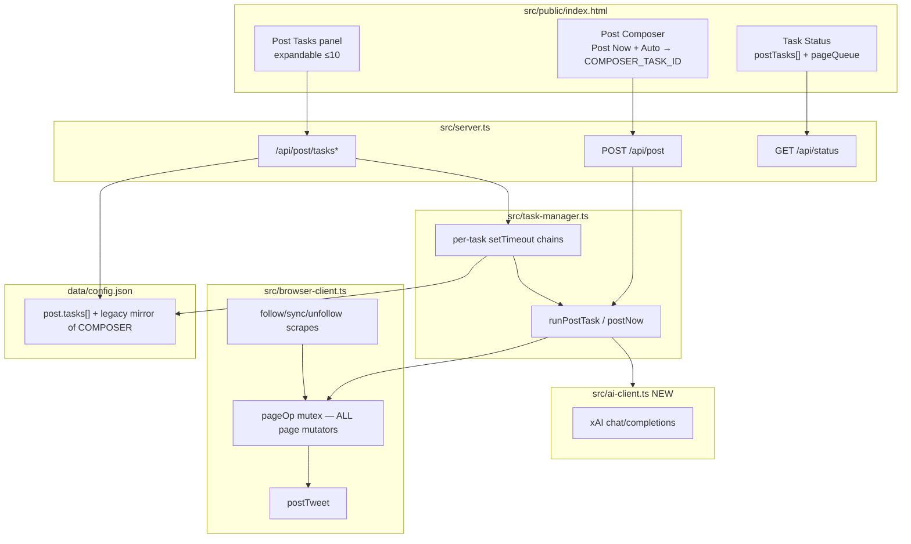
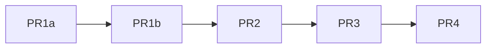

# Multi-Task Post Automation Design

| Field | Value |
|-------|-------|
| **Document title** | Multi-Task Post Automation (static + AI modes) |
| **Author** | auto-x engineering |
| **Date** | 2026-08-07 |
| **Status** | Draft (rev 2.2 — lift/mirror path split) |
| **Workspace** | `/home/lighthouse/auto-x` |
| **Audience** | Senior engineers implementing incremental PRs |
| **Revision** | Addresses design review Issues 1–17 + re-review 1–5 + lift clobber fix |

---

## Overview

Today auto-x supports a **single** auto-post slot: one template string, one interval, one `setTimeout`/`setInterval` timer (`TaskManager.postTimer`), persisted under `data/config.json` key `post` (`PostConfig` in `src/auto-config.ts`). Manual **Post Now** (`POST /api/post` → `TaskManager.postNow` → `BrowserClient.postTweet(..., { force: true })`) works in production and must keep working.

This design introduces **up to 10 independent post tasks**, each with its own content, interval, enable flag, and optional **AI mode** (content field is a prompt; server calls xAI and posts the model output). Tasks never share timers or content.

**Browser serialization** uses a **BrowserClient-wide page mutex** (not post-only): all page-mutating operations—posts, follow-back, sync scrapes, batch follow/unfollow—share one async queue so multi-task posting cannot corrupt concurrent follow-back cycles (and vice versa). Config migrates cleanly from the legacy single-slot `post` shape on first load, with a **stable composer-linked task id** that dual-writes legacy fields for the existing UI.

---

## Background & Motivation

### Current state (verified in code)

| Component | Path | Behavior today |
|-----------|------|----------------|
| Config model | `src/auto-config.ts` | `PostConfig`: `templates[]`, `autoPostEnabled`, `autoPostIntervalMinutes`, `autoPostTemplateIndex`, `lastPostAt`, `postAutoIndex` — **no** `version`/`tasks` |
| Load/save | `loadPostConfig` / `savePostConfig` | Read/write `data/config.json` → `post`; plain `writeFileSync` (no tmp+rename) |
| Scheduler | `src/task-manager.ts` | Single `postTimer` (`setTimeout` then `setInterval`); `startPostSchedule`, `stopPostSchedule`, `restorePostScheduleFromConfig` |
| Manual post | `TaskManager.postNow` | `BrowserClient.postTweet(text, { force: true })` — **bypasses active hours** |
| Auto post body | `startPostSchedule` → `doPost` | Appends Beijing compact timestamp `\n\n${ts} ⏳`; increments `postAutoIndex` **before** post (even on skip/fail); **no** 280 clamp after suffix |
| Active hours | `BrowserClient.postTweet` | Without `force`, skips when outside `automation.activeHoursStart/End` |
| Shared page | `BrowserClient` | **One** Playwright `page` for posts **and** follow/sync/unfollow navigations |
| API | `src/server.ts` | `POST /api/post` (send + persist + start/stop); legacy `POST /api/post/schedule*`; `GET/POST /api/post/config` |
| UI load | `index.html` `loadPostConfig` | Reads **legacy only**: `autoPostEnabled`, `autoPostIntervalMinutes`, `templates[0]` |
| Task Status | same HTML | Only generic `data.task` (sync/follow), not multi post |
| Startup restore | `src/index.ts` | `restorePostScheduleFromConfig()` after auth |
| LLM | — | None; no `XAI_*` in `.env.example` |
| Runtime | `Dockerfile` | `node:24-slim` (native `fetch` + `AbortSignal.timeout` OK; min Node **18+**) |
| Tests | `package.json` | No test script (typecheck/dev/start only) |

### Pain points

1. **One schedule only** — cannot run independent intervals together.
2. **No per-task isolation** — composer Post Now overwrites the sole template and restarts the sole timer.
3. **No AI generation**.
4. **Status opacity** — single `postSchedule` blob.
5. **Latent page race** — multi post timers + long follow-back cycles share one page without serialization (amplified by multi-task).

### Product risk (explicit)

Automating posts may violate X terms or trigger rate/spam defenses. Active-hours gating, intervals ≥ 5 minutes, max 10 tasks, and sequential browser ops are intentional mitigations. Operators own API keys and account risk.

---

## Goals & Non-Goals

### Goals

1. Support **≤ 10 independent post tasks**, each with: enable flag, interval, content, content mode (`static` | `ai`), runtime status.
2. **Backward-compatible migration** of existing `post` config into the **composer-linked task** (`COMPOSER_TASK_ID`).
3. **Do not break** manual Post Now or restart restore of the previously working single auto-post.
4. **Optional AI mode per task**: prompt → xAI chat completions → post response text.
5. AI/provider failures **must not kill** the scheduler process or other tasks (log, mark error, retry next interval).
6. Tweet body ≤ **280** characters (including anti-dupe suffix for auto posts). Clamp scheduled posts; do not regress manual Post Now validation.
7. **Browser page mutex** serializing **all** page-mutating BrowserClient ops (posts + follow/sync/unfollow paths that use `page`), so multi-task does not amplify races with follow-back.
8. Preserve **anti-duplicate timestamp suffix** for scheduled (auto) posts only.
9. **Task Status UI** lists each post task: enabled, next run, last result, last error, phase.
10. **Incremental PR plan** so PR1 keeps today’s behavior working before multi-task UI and AI land.

### Non-Goals

- Multi-account / multi-browser profiles.
- X Official API posting (still browser-only via Playwright).
- Per-task active hours (global `automation.activeHours*` remains the only gate for scheduled posts).
- Streaming LLM UI, conversation history, or multi-turn chat.
- Image/video/media posts.
- Cron-like “wall clock” schedules — v1 is **interval minutes** only.
- Storing `XAI_API_KEY` in `config.json` or returning it to the browser.
- Changing follow-back **business** semantics (only add page-mutex wrapping around existing page ops).
- True rollback of **pre-PR1** binary against a v2-only `config.json` without restoring `.bak` (see §4.5).

---

## Key Decisions

| # | Decision | Choice | Rationale |
|---|----------|--------|-----------|
| K1 | Config shape | `post.version=2`, `post.tasks[]`, `post.ai`; dual-write **composer-linked** into legacy top-level fields | Zero-downtime migrate; current UI reads legacy only |
| K2 | Max tasks | Hard cap **10** on **all** write paths (create, bulk PATCH, `POST /api/post/config`) | Product limit |
| K3 | Timer model | **One `setTimeout` chain per enabled task** (`Map<taskId, Timeout>`); pattern aligned with follow-back auto (`scheduleFollowBackAutoNext`) | Independence; consistent clearTimeout |
| K4 | Browser serialization | **BrowserClient page mutex** (`pageOp` / shared queue) for **outermost public entry points only** (non-reentrant; see §5.2.1) | Single page; multi-task + follow-back coexistence |
| K5 | Manual Post Now | Top-level composer + `POST /api/post`; **force** path; **priority lane** ahead of pending non-force jobs; **never preempts in-flight pageOp** (worst case = current follow-back/scrape duration) | Production path; avoid multi-minute hang behind *pending* scheduled posts only |
| K6 | AI provider | xAI OpenAI-compatible: default base `https://api.x.ai/v1`, env `XAI_API_KEY`, default model `grok-4.5` | Project default; key server-side only |
| K7 | AI failures | Catch → `lastError`, phase `error` then `waiting`/`idle`; **keep timer**; no inter-interval 429 backoff in v1 | Scheduler resilience; document 429 storms |
| K8 | Length control | **Runtime** `[...suffix].length` for max body; one AI shorten retry then grapheme truncate; system prompt + docs target **under 240** chars (same budget) | Suffix length is locale-dependent; 240 leaves headroom |
| K9 | Status surface | `postTasks[]` full multi-task; **`postSchedule` always derived from composer-linked task only** | Old UI checkbox/next-run stay coherent |
| K10 | Anti-dupe | Suffix on **scheduled** posts only; manual / force / run-once: raw text | Match production |
| K11 | Active hours | Unchanged | Product intent |
| K12 | IDs | **`COMPOSER_TASK_ID = 'task-migrated-default'`** fixed; other tasks `task-${uuid}` | Stable composer contract |
| K13 | Content modes | `static` \| `ai` on `content` field | Simple |
| K14 | Incremental delivery | PR1a migrate+config lock; PR1b page mutex+scheduler; PR2 multi UI; PR3 AI; PR4 polish | Never break Post Now |
| K15 | Composer dual-write | Always mirror **composer-linked by id**, never `tasks[0]` | UI desync fix |
| K16 | Config RMW | `updatePostConfig`: lock + load → mutator (**task by id**) → **`mirrorComposerToLegacy` only** → atomic full-root save. **No lift** on this path | Composer-first mutators must not be overwritten by stale legacy |
| K17 | Stop mapping | `stopPostSchedule()` ≡ `stopPostTaskSchedule(COMPOSER_TASK_ID)` only; never stop-all from `/api/post` or legacy routes | Critical multi-task isolation |
| K18 | Dual-write lifetime | Remain **on** until a later deprecation release with explicit flag defaulting dual-write **on**; PR4 must **not** casually remove | External/old UI readers |
| K19 | Config root save | Atomic save always **read-merge full `config.json`** → set `root.post` only → tmp+rename; never write `{post}` alone | Preserve `automation` and any other keys |
| K20 | Dual-write save paths | Preferred: composer-first `updatePostConfig` + **mirror only**. Deprecated: `savePostConfig` = **lift then mirror**. Do not deploy PR1a to prod without PR1b | Path split (option A) avoids lift clobber; 1a+1b ship together |

---

## Proposed Design

### 1. Architecture (high level)



### 2. Runtime sequence — scheduled AI task fire

```mermaid
sequenceDiagram
  participant T as Task timer
  participant TM as TaskManager
  participant AI as AiClient
  participant BC as BrowserClient pageOp
  participant FS as updatePostConfig

  T->>TM: tick(taskId)
  TM->>TM: phase=generating (if ai)
  alt contentMode=ai and POST_AI_ENABLED
    TM->>AI: complete(prompt, model)
    AI-->>TM: text or throw
    Note over TM: on throw: lastError, phase=error→waiting, arm next timer
  else static
    TM->>TM: text = content
  end
  TM->>TM: build suffix at runtime; clamp body; phase=queued
  TM->>BC: pageOp → postTweet(text) no force
  Note over BC: may wait behind follow-back page ops
  BC-->>TM: {ok, skipped?}
  TM->>FS: merge task lastPostAt/postCount/lastResult (only on ok for lastPostAt)
  TM->>TM: phase=waiting if enabled else idle; arm next timeout
```

### 3. Data model

#### 3.1 Constants & types (`src/auto-config.ts`)

```typescript
/** Fixed id for the task bound to Post Composer + legacy dual-write + postSchedule */
export const COMPOSER_TASK_ID = 'task-migrated-default';

export const MAX_POST_TASKS = 10;
export const MIN_POST_INTERVAL_MINUTES = 5;
export const TWEET_MAX_CHARS = 280;
/** Soft budget only; always compute real suffix length at post time */
export const ANTI_DUPE_SUFFIX_RESERVE_HINT = 24;

export type PostContentMode = 'static' | 'ai';

export type PostTaskPhase =
  | 'idle'         // disabled or no timer
  | 'waiting'      // timer armed
  | 'generating'   // AI in flight (outside page mutex)
  | 'queued'       // waiting for pageOp mutex
  | 'posting'      // inside pageOp postTweet
  | 'error';        // last run failed; transient until reschedule sets waiting/idle

export interface PostTaskConfig {
  id: string;
  name: string;
  enabled: boolean;
  intervalMinutes: number;
  contentMode: PostContentMode;
  content: string;
  model?: string | null;
  lastPostAt: string | null;
  /** Incremented at start of each scheduled attempt (match today); not used in tweet body */
  postAutoIndex: number;
  postCount: number;
  lastResult: string | null;
  lastError: string | null;
  createdAt: string;
  updatedAt: string;
}

export interface PostAiSettings {
  defaultModel: string;   // 'grok-4.5'
  maxTokens: number;      // 200
  temperature: number;    // 0.8
  systemPrompt: string;
}

export interface PostConfig {
  version: 2;
  tasks: PostTaskConfig[];
  ai: PostAiSettings;
  // Legacy dual-write mirror of COMPOSER_TASK_ID (required on every save/load response for PR1 UI)
  templates: string[];
  autoPostEnabled: boolean;
  autoPostIntervalMinutes: number;
  autoPostTemplateIndex: number;
  lastPostAt: string | null;
  postAutoIndex: number;
}

export const DEFAULT_POST_AI: PostAiSettings = {
  defaultModel: 'grok-4.5',
  maxTokens: 200,
  temperature: 0.8,
  /** Soft target must match K8: under 240 graphemes (runtime clamp still uses suffix length). */
  systemPrompt:
    'You write short posts for X/Twitter. Reply with only the post text, no quotes or preamble. Stay under 240 characters so a short timestamp suffix can be added.',
};

export const DEFAULT_POST: PostConfig = {
  version: 2,
  tasks: [],
  ai: { ...DEFAULT_POST_AI },
  templates: [
    '互相关注了！感谢关注 🙏',
    'Thanks for the mutual follow! 🤝',
  ],
  autoPostEnabled: false,
  autoPostIntervalMinutes: 60,
  autoPostTemplateIndex: 0,
  lastPostAt: null,
  postAutoIndex: 0,
};
```

#### 3.2 Phase transition table (normative)

| From | Event | To |
|------|-------|-----|
| idle | enable + arm timer | waiting |
| waiting | timer fires | generating (ai) or queued (static) |
| generating | AI ok | queued |
| generating | AI fail | error → then waiting (if still enabled) after arming next |
| queued | pageOp acquired | posting |
| posting | ok / skipped / fail | waiting (enabled) or idle (disabled) |
| any | disable / stop | idle (clear timeout) |
| error | next timer armed | waiting |

`error` is **transient for UI** (may show for one poll cycle); after `scheduleNext`, phase is `waiting` if enabled. Persist `lastError` string independently of phase.

#### 3.3 Runtime overlays (TaskManager memory)

```typescript
interface PostTaskRuntime {
  timer: ReturnType<typeof setTimeout> | null;
  phase: PostTaskPhase;
  nextRunAt: string | null;
  lastGeneratedPreview?: string | null;
  consecutiveErrors: number; // in-memory; optional status field from PR2+
}

// Status fragment for who owns the page:
// pageQueue: { depth: number; currentLabel: string | null; currentTaskId: string | null }
```

### 4. Migration strategy

#### 4.1 Detect v1 vs v2

```typescript
function isPostConfigV2(raw: unknown): raw is PostConfig {
  return !!raw && typeof raw === 'object'
    && (raw as any).version === 2
    && Array.isArray((raw as any).tasks);
}
```

**Anti-pattern (forbidden):** `{ ...DEFAULT_POST, ...raw.post }` on a v1 object. That would set `version: 2` via DEFAULT while leaving `tasks` empty or wrong. **Only** `loadPostConfig()` may load; it always runs migrate.

#### 4.2 v1 → v2 (`migratePostConfigV1ToV2`)

| Legacy field | Maps to |
|--------------|---------|
| `templates[autoPostTemplateIndex \|\| 0]` or `templates[0]` | `tasks[COMPOSER].content` |
| `autoPostEnabled` | `tasks[COMPOSER].enabled` (false if content empty) |
| `autoPostIntervalMinutes` | `tasks[COMPOSER].intervalMinutes` (min 5) |
| `lastPostAt` | `tasks[COMPOSER].lastPostAt` |
| `postAutoIndex` | `tasks[COMPOSER].postAutoIndex` |
| remaining templates | kept in top-level `templates` array for mirror; index 0 = composer content |

Composer task after migrate:

```typescript
{
  id: COMPOSER_TASK_ID, // 'task-migrated-default'
  name: 'Default',
  enabled: !!raw.autoPostEnabled && !!content.trim(),
  intervalMinutes: Math.max(MIN_POST_INTERVAL_MINUTES, raw.autoPostIntervalMinutes || 60),
  contentMode: 'static',
  content: content || '',
  model: null,
  lastPostAt: raw.lastPostAt ?? null,
  postAutoIndex: raw.postAutoIndex || 0,
  postCount: 0,
  lastResult: null,
  lastError: null,
  createdAt: nowIso,
  updatedAt: nowIso,
}
```

If `autoPostEnabled` was true but content empty: `enabled: false`, and after mirror **legacy `autoPostEnabled: false`** so UI does not show Auto on with empty content. Log warning (same spirit as today’s restore skip).

#### 4.3 Empty install

- `DEFAULT_POST` with `tasks: []` and legacy template defaults.
- **First `POST /api/post`** (any Auto setting) **ensures composer task exists** via `ensureComposerTask(text, …)` with id `COMPOSER_TASK_ID`.
- No need to create composer task at process start if user never posts.

#### 4.4 Dual-read / dual-write (normative)

On every successful `loadPostConfig` that migrates v1 → v2: **eager rewrite** to disk via atomic save + `.bak` (see §4.6).

On every `updatePostConfig` / save:

1. Ensure composer task exists if any legacy enable path needs it.
2. Call `mirrorComposerToLegacy(cfg)`:
   - Find task by `id === COMPOSER_TASK_ID` (if missing: legacy fields reflect defaults / disabled).
   - `templates[0] = composer.content` (preserve other template slots if any).
   - `autoPostEnabled = composer.enabled`
   - `autoPostIntervalMinutes = composer.intervalMinutes`
   - `autoPostTemplateIndex = 0`
   - `lastPostAt = composer.lastPostAt`
   - `postAutoIndex = composer.postAutoIndex`
3. **Never** mirror `tasks[0]` by array index.

`GET /api/post/config` **always** returns full v2 object **including** populated legacy fields (even right after migrate, before any user save)—so PR1 needs **zero** UI changes.

#### 4.5 Rollback (ops)

| Scenario | Action |
|----------|--------|
| Roll forward/back **within** feature train (PR1+) | Dual-read of v1+v2 in all feature PRs |
| Roll back to **pre-PR1** binary | **Must** restore `data/config.json.bak` taken on first migrate (or hand-edit to v1). Pre-PR1 binary does **not** understand `version:2` / `tasks` and will mis-spread |
| Disable multi-task product-wise | Disable non-composer tasks; dual-write stays |

#### 4.6 Atomic write + backup (PR1 required)

**Normative algorithm — preserve non-`post` keys (critical):**

Today’s `savePostConfig` already reads the full `data/config.json`, assigns `existing.post = config`, and writes the whole object—preserving `automation` (auth tokens, follow-back, active hours). Atomic save **must keep that merge**, not serialize `{ post: cfg }` alone.

```typescript
function atomicSavePostConfig(postCfg: PostConfig): void {
  // 1) First migrate only: copy config.json → config.json.bak (if not already bak'd)
  // 2) Read full root (or {} if missing)
  // 3) root.post = postCfg   // DO NOT replace root with { post: postCfg }
  // 4) write config.json.tmp with JSON.stringify(root, null, 2)
  // 5) fsync tmp; rename tmp → config.json
}

// Same pattern for saveAutomationConfig: root.automation = …; never wipe post.
```

| Forbidden | Why |
|-----------|-----|
| `writeFileSync(CONFIG_FILE, JSON.stringify({ post: cfg }))` | **Wipes `automation`** (tokens, active hours, follow-back) |
| Writing only the post object without reading root first | Same |
| Two writers without shared lock on root | Last writer wins; use `updatePostConfig` / paired automation save carefully |

Replace plain `writeFileSync` for post (and preferably automation) config saves, but **always** full-file read-merge-write.

### 5. Browser page mutex (not post-only)

#### 5.1 Problem (Issue 1)

`BrowserClient` uses a **single** `page` for:

- `postTweet` (goto home, type, submit)
- follow-back scan / profile navigations
- batch follow/unfollow UI flows
- sync-related scrapes that touch `page`

A post-only queue leaves **High** residual risk: scheduled multi-task posts during `runFollowBackAutoCycle` can interleave `goto` and corrupt both flows.

#### 5.2 Design (preferred): `pageOp` on BrowserClient

```typescript
// Inside BrowserClient
private pageChain: Promise<void> = Promise.resolve();
private pageQueueDepth = 0;
private pageCurrentLabel: string | null = null;
/** True while executing the body of an outer pageOp (same async continuation). */
private pageOpActive = false;

/** Serialize all page-mutating work. Non-reentrant — see §5.2.1. */
pageOp<T>(label: string, fn: () => Promise<T>): Promise<T> {
  this.pageQueueDepth++;
  const run = this.pageChain.then(async () => {
    this.pageCurrentLabel = label;
    this.pageOpActive = true;
    try {
      return await fn();
    } finally {
      this.pageOpActive = false;
      this.pageCurrentLabel = null;
      this.pageQueueDepth = Math.max(0, this.pageQueueDepth - 1);
    }
  });
  this.pageChain = run.then(() => undefined, () => undefined);
  return run;
}

async postTweet(text: string, options?: { force?: boolean; priority?: boolean }) {
  // Outermost entry: wraps once. Body and helpers MUST NOT call pageOp again.
  return this.pageOp(options?.force ? 'post:force' : 'post:scheduled', async () => {
    // existing postTweet body — may call private helpers that use this.page bare
  });
}
```

##### 5.2.1 Nested re-entrancy policy (normative — prefer simplicity)

`pageOp` is a **non-reentrant** promise chain. If method A is inside `pageOp` and calls method B that also calls `pageOp`, B waits forever on A’s still-held chain → **deadlock**.

| Rule | Detail |
|------|--------|
| **Chosen policy (1)** | Only **outermost public entry points** used by TaskManager / Service / server may call `pageOp`. Internal helpers and private methods that touch `this.page` run **bare** under the caller’s op. |
| **Not chosen (2)** | ALS/`AsyncLocalStorage` re-entry so nested `pageOp` runs inline — more complex; adopt only if a call graph forces it later. |
| **Debug guard (recommended)** | If `pageOp` is entered while `pageOpActive === true` on the same client, `console.error` + throw `pageOp re-entrancy` in dev/`NODE_ENV!==production` (or always log + throw) to fail fast during PR1b. |
| **Composition** | Prefer one outer `pageOp('follow-back:cycle', async () => { … all scrapes/follows … })` at TaskManager/Service boundary **or** wrap each public BrowserClient method once and ensure those methods never call other *wrapped* public methods. |

**PR1b checklist (with `this.page` grep):**

1. List every public method that mutates/navigates `page`.
2. Mark which are **outer** (call `pageOp`) vs **inner** (bare `this.page`, only invoked under an outer op).
3. Prove no outer → outer call path (static review or throw-on-reentry test).
4. Prefer wrapping at the **widest** useful entry (`runFollowBackAutoCycle` via a single `browser.pageOp` around the whole cycle, **or** one wrap per Service-facing BrowserClient method that does not call siblings).

**Wrap (minimum outer surface for PR1b):**

| Method / path | Wrap with `pageOp`? |
|---------------|---------------------|
| `postTweet` | Yes (outer) |
| Public batch follow/unfollow entry used by Service | Yes (outer), **or** single outer at Service if it batches many page steps |
| Public follow-back scrape entry | Yes (outer) |
| Internal helpers (`clickFollow`, goto profile, etc.) | **No** — bare page under outer |
| Pure cookie/API helpers with no page | No |

TaskManager does **not** need a separate PostQueue if BrowserClient owns the mutex; optional thin alias is fine.

#### 5.3 Residual risk if only partial wrap

If an implementer misses an **outer** page entry (unserialized concurrent use), severity **High** until audited. If they wrap every helper and cause re-entry, severity **Critical** (deadlock). PR1b must pass both the outer-entry audit and the no-nested-`pageOp` rule.

#### 5.4 Manual Post Now latency / priority

FIFO alone: worst case ~10 scheduled posts × ~15s + follow-back cycle (minutes) → Post Now appears hung.

**Normative PR1 behavior:**

1. **(A) Preferred:** priority lane: force posts jump ahead of **pending non-started** scheduled jobs.
2. **Hard limit:** Force **never preempts an in-flight `pageOp`**. If a follow-back scrape/follow cycle currently holds the page, Post Now **waits for that entire outer op to finish**. Worst-case wait ≈ duration of current follow-back/scrape (can be **minutes**). This is a **known UX limitation** of single-page automation; cooperative yield points inside long scrapes are **out of scope for v1**.
3. UI: when `pageQueue.depth > 0` or wait > ~2s, toast/status “Waiting for browser… (`pageQueue.currentLabel`)” via poll of `/api/status`.

Implement priority with two lanes or a deque: force `unshift` among pending; in-flight op always completes first. Scheduled tasks in `queued` re-enter after force.

Also: **skip scheduled post** (not force) if `followBackAutoRunning === true` **recommended** soft mitigation (`lastResult = 'deferred: follow-back running'`, do not advance `lastPostAt`, still reschedule). Force Post Now never skips for follow-back (waits on mutex until in-flight op ends, then runs ahead of other pending scheduled posts).

### 6. Per-task scheduler

#### 6.1 API (normative method mapping)

```typescript
const COMPOSER_TASK_ID = 'task-migrated-default';

startPostTaskSchedule(taskId: string, firstDelayMs?: number): void
stopPostTaskSchedule(taskId: string): void   // clearTimeout only that id
stopAllPostTaskSchedules(): void             // internal/shutdown ONLY

/** @deprecated alias — MUST equal stopPostTaskSchedule(COMPOSER_TASK_ID) */
stopPostSchedule(): void

/** @deprecated alias — start composer task only */
startPostSchedule(intervalMinutes, templateText, firstDelayMs?): void

restoreAllPostTasksFromConfig(): void
/** @deprecated alias → restoreAllPostTasksFromConfig */
restorePostScheduleFromConfig(): void
```

**Forbidden:** binding `stopAllPostTaskSchedules` to `POST /api/post`, `POST /api/post/schedule`, `/schedule/stop`, or composer Auto off.

#### 6.2 First-delay (parity with today)

| Condition | firstDelay |
|-----------|------------|
| no `lastPostAt` | full interval; **write** `lastPostAt = now` via `updatePostConfig` so restarts don’t zero countdown |
| `elapsed >= interval` | 1000 ms catch-up |
| else | `intervalMs - elapsed` |

#### 6.3 Ongoing cadence

Pure **`setTimeout` chain** (not `setInterval`):

- After each attempt (success, skip, fail, AI fail): if still enabled → `next = now + intervalMs`, `phase = waiting`, arm timeout.
- Use **`clearTimeout`** only (never `clearInterval` on these handles).
- Timer type: `ReturnType<typeof setTimeout> | null`.

#### 6.4 Acceptance cases (PR1 required)

| # | Case | Expected |
|---|------|----------|
| T1 | success | `lastPostAt` updated; `postCount++`; next timer armed |
| T2 | active-hours skip (`skipped: true`) | `lastPostAt` **unchanged**; next timer armed; `lastResult` notes skip |
| T3 | post fail / throw | `lastPostAt` **unchanged**; `lastError` set; next timer armed if enabled |
| T4 | AI fail (PR3) | no post; `lastError`; next timer armed |
| T5 | disable / stop | timeout cleared; phase idle; no further fires |
| T6 | delete non-composer | timeout cleared; removed from config |
| T7 | composer Auto off via POST /api/post | **only** composer timer stopped; other tasks untouched (PR2+) |
| T8 | `postAutoIndex` | increments at **start** of scheduled attempt (match today), including skip/fail paths |

#### 6.5 Independence

Enabling/editing task A never stops task B. PR1 with only composer task still implements the multi-map so PR2 cannot regress.

### 7. Content resolution & length

```typescript
function buildAntiDupeSuffix(now = new Date()): string {
  const ts = formatInTimezone(now, DEFAULT_TIMEZONE, { compact: true });
  return `\n\n${ts} ⏳`;
}

function truncateGraphemes(s: string, max: number): string {
  const chars = [...s];
  if (chars.length <= max) return s;
  return chars.slice(0, max).join('');
}

/** Scheduled posts only */
function finalizeScheduledText(body: string): string {
  const suffix = buildAntiDupeSuffix();
  const maxBody = TWEET_MAX_CHARS - [...suffix].length;
  let b = body.trim();
  if ([...b].length > maxBody) b = truncateGraphemes(b, maxBody);
  return b + suffix;
}
```

**Manual / force / run-once:** no suffix; server continues to validate with existing UTF-16 `length > 280` check for parity with UI `maxlength` (pre-existing X weighted-count mismatch is accepted; do not “fix” manual path in PR1).

**PR1 smoke matrix (Issue 8):**

| Case | Expected |
|------|----------|
| Manual 280-char BMP post | succeeds (force), no suffix |
| Auto template 270 BMP + suffix | final ≤280 |
| Auto template 280 BMP | body truncated then suffix; final ≤280 |
| Manual path never double-suffixed | raw text only |

### 8. AI client (`src/ai-client.ts`)

#### 8.1 Client

As previously designed; **base URL validation:**

```typescript
function resolveBaseUrl(raw?: string): string {
  const u = raw || process.env.XAI_BASE_URL || 'https://api.x.ai/v1';
  const parsed = new URL(u);
  if (parsed.protocol !== 'https:') throw new Error('XAI_BASE_URL must be https');
  const allowed = new Set(['api.x.ai']);
  // allow override only if host in allowlist OR env XAI_ALLOW_INSECURE_BASE=1 for local mock
  if (!allowed.has(parsed.hostname) && process.env.XAI_ALLOW_INSECURE_BASE !== '1') {
    throw new Error(`XAI_BASE_URL host not allowed: ${parsed.hostname}`);
  }
  return u.replace(/\/$/, '');
}
```

Env is trusted-operator territory; allowlist documents SSRF posture.

#### 8.2 `sanitizeAiTweet`

```typescript
function sanitizeAiTweet(raw: string): string {
  let s = raw.trim();
  // strip ``` ... ``` fences (optional language tag)
  s = s.replace(/^```(?:\w+)?\s*\n?([\s\S]*?)\n?```$/u, '$1').trim();
  // strip one layer of wrapping quotes
  if ((s.startsWith('"') && s.endsWith('"')) || (s.startsWith('“') && s.endsWith('”'))) {
    s = s.slice(1, -1).trim();
  }
  // collapse 3+ newlines to 2; strip trailing spaces per line
  s = s.replace(/[ \t]+\n/g, '\n').replace(/\n{3,}/g, '\n\n').trim();
  // if model returned multiple paragraphs with analysis, take first non-empty paragraph block up to 2 newlines? 
  // v1: keep full sanitized text; length clamp handles overflow
  return s;
}
```

#### 8.3 Truncation / retry

1. Sanitize.
2. If over maxBody: one completion retry with user append: `Rewrite under N characters. Output only the post text.`
3. Still long → grapheme truncate + log.
4. Empty → throw → task error path.

#### 8.4 429 / storms

No inter-interval exponential backoff in v1. Each interval × each AI-enabled task may call xAI again. Document in ops: fix key/quota or disable AI tasks. Optional `consecutiveErrors` in status (PR2+).

#### 8.5 Feature flag & pre-PR3 runtime

- Env `POST_AI_ENABLED`: default `true` when `XAI_API_KEY` set, else `false`.
- **PR1–PR2 runtime:** if `contentMode === 'ai'` but AI not shipped/flag off → treat as **skip fire** with `lastError = 'AI mode not available'`, keep schedule; or force-static of `content` only if product prefers—**normative: skip with lastError**, do not post prompt text as tweet.
- Enabling AI via API when `!aiClient.isConfigured()`: allow save; response includes `warning: 'XAI_API_KEY not configured'`; UI badge red (PR3).

#### 8.6 Enabling without key

Save allowed. Fire sets `lastError`. UI shows configured badge from `GET /api/post/ai/status` → `{ configured: boolean, defaultModel }` (never key).

### 9. API / Interface Changes

#### 9.1 Composer-linked invariants (locked)

1. **Id:** always `COMPOSER_TASK_ID = 'task-migrated-default'`.
2. **Create:** on first `POST /api/post` or migrate from v1; never random uuid for composer.
3. **Dual-write / `postSchedule`:** always from this id.
4. **DELETE `/api/post/tasks/:id`:** if `id === COMPOSER_TASK_ID` → **400** `{ error: 'Cannot delete composer-linked task; disable Auto instead' }`. (Shell always remains once created; empty install may have zero tasks until first post.)
5. **Other tasks:** normal delete.

#### 9.2 `POST /api/post` (all PRs after multi structure — single normative behavior)

Body: `{ text, autoPostEnabled?, intervalMinutes? }` (unchanged).

| Step | Behavior |
|------|----------|
| 1 | Validate `text` non-empty; `text.length <= 280` (UTF-16, existing) |
| 2 | `updatePostConfig`: `ensureComposerTask`; set composer `content=text`, `contentMode='static'`; if `autoPostEnabled` then set `enabled`, `intervalMinutes` (≥5); else `enabled=false`; mirror legacy |
| 3 | `stopPostTaskSchedule(COMPOSER_TASK_ID)` **only** |
| 4 | `postNow(text)` via page mutex force (+ priority) |
| 5 | On `result.ok`: `updatePostConfig` composer `lastPostAt=now` (and postCount optional for manual) |
| 6 | If auto on: `startPostTaskSchedule(COMPOSER_TASK_ID)` with full interval first delay from now |

**Post Now without Auto:** still **persists** composer `content` + legacy `templates[0]` so reload fills textarea (match today). Does **not** enable schedule. Does **not** stop other tasks’ timers.

#### 9.3 PR1 compatibility matrix

| Endpoint | Response / behavior |
|----------|---------------------|
| `GET /api/post/config` | Always includes `version`, `tasks`, `ai`, **and** legacy fields filled from composer (or defaults). Current UI only reads legacy—works unchanged |
| `POST /api/post` | Same JSON shape as today (`ok`, `posted`, `autoPostEnabled`, `intervalMinutes`, `message`); side effects only composer task |
| `POST /api/post/config` | **Must not** bulk-replace `tasks` arbitrarily in PR1; accept partial legacy fields + optional `ai`; if `tasks` provided, validate max 10, preserve `COMPOSER_TASK_ID` presence rules. Prefer PR2 for task mutation via `/api/post/tasks*` |
| `GET /api/status` | Adds `postTasks[]` (0–1 entries in PR1), `pageQueue`; **`postSchedule` from composer only** |
| `POST /api/post/schedule/stop` | `stopPostTaskSchedule(COMPOSER_TASK_ID)` + composer `enabled=false` |
| `POST /api/post/schedule` enable | Updates composer only + start composer timer |
| `POST /api/post/schedule/start` | Composer only |

#### 9.4 New endpoints (PR2+)

```
GET    /api/post/tasks
POST   /api/post/tasks              // 400 if tasks.length >= 10; cannot create second COMPOSER id
GET    /api/post/tasks/:id
PATCH  /api/post/tasks/:id
DELETE /api/post/tasks/:id          // 400 if composer
POST   /api/post/tasks/:id/enable
POST   /api/post/tasks/:id/run      // force; no anti-dupe suffix
GET    /api/post/ai/status          // PR3
PATCH  /api/post/ai                 // PR3 — PostAiSettings only
```

Validation: name 1–64; interval ≥5 when enabling; content non-empty when enabling; contentMode ∈ static\|ai; max 10 on create **and** any bulk write.

#### 9.5 Status payload

```typescript
postTasks: Array<{
  id: string;
  name: string;
  enabled: boolean;
  contentMode: 'static' | 'ai';
  intervalMinutes: number;
  nextRunAt: string | null;
  lastPostAt: string | null;
  lastResult: string | null;
  lastError: string | null;
  phase: PostTaskPhase;
  postCount: number;
  contentPreview: string;
  consecutiveErrors?: number;
}>;
postSchedule: { // ALWAYS composer-linked derivation
  enabled: boolean;
  intervalSeconds: number;
  templatePreview: string;
  nextRunAt: string | null;
};
pageQueue: {
  depth: number;
  currentLabel: string | null;
  currentTaskId: string | null; // if post task owns pageOp
};
```

### 10. Config RMW (PR1 deliverable)

#### 10.0 Dual-write path split (normative — option A)

Unconditional lift inside `updatePostConfig` **clobbers** composer-first mutators:

1. mutator sets `tasks[COMPOSER].lastPostAt = T1` (legacy still T0)  
2. full lift copies legacy → composer → T0 again  
3. mirror leaves both at T0  

**Chosen policy (A) — split paths:**

| API | Mutator edits | After mutator | Use |
|-----|---------------|---------------|-----|
| **`updatePostConfig`** (preferred, all PR1b+ live sites) | **Tasks by id** (composer + other tasks). Do **not** write dual-write via legacy fields alone | **`mirrorComposerToLegacy` only** — **never** `liftLegacyIntoComposer` | TaskManager, server `/api/post`, task CRUD |
| **`savePostConfig`** (deprecated transitional) | May still set **legacy** fields only (pre-1b style) | **`liftLegacyIntoComposer` then `mirrorComposerToLegacy`** | Only until PR1b rewrites callers; or tests of legacy path |

Composer task is **source of truth** after any preferred mutator. Lift exists solely to rescue legacy-only writes on the deprecated path.

```typescript
// src/auto-config.ts
let configLock: Promise<void> = Promise.resolve();

/** Composer dual-write fields → legacy top-level (templates[0], autoPost*, lastPostAt, postAutoIndex). */
export function mirrorComposerToLegacy(cfg: PostConfig): void {
  const c = cfg.tasks.find((t) => t.id === COMPOSER_TASK_ID);
  if (!c) {
    cfg.autoPostEnabled = false;
    // leave templates defaults if no composer yet
    return;
  }
  if (!cfg.templates?.length) cfg.templates = [c.content];
  else cfg.templates[0] = c.content;
  cfg.autoPostEnabled = c.enabled;
  cfg.autoPostIntervalMinutes = c.intervalMinutes;
  cfg.autoPostTemplateIndex = 0;
  cfg.lastPostAt = c.lastPostAt;
  cfg.postAutoIndex = c.postAutoIndex;
}

/**
 * Legacy dual-write fields → composer task (create shell if missing).
 * ONLY for deprecated savePostConfig / transitional legacy-only callers.
 * MUST NOT run after a composer-first mutator.
 */
export function liftLegacyIntoComposer(cfg: PostConfig): void {
  // ensure COMPOSER_TASK_ID exists; copy lastPostAt, enabled, interval, templates[0], postAutoIndex
  // from legacy fields onto that task
}

export async function updatePostConfig(
  mutator: (cfg: PostConfig) => void,
): Promise<PostConfig> {
  let result!: PostConfig;
  const prev = configLock;
  let release!: () => void;
  configLock = new Promise<void>((r) => { release = r; });
  await prev;
  try {
    const cfg = loadPostConfig();
    mutator(cfg); // MUST patch tasks by id for dual-write fields
    if (cfg.tasks.length > MAX_POST_TASKS) {
      throw new Error(`Max ${MAX_POST_TASKS} post tasks`);
    }
    // Composer-first path: mirror ONLY — no lift (would clobber mutator)
    mirrorComposerToLegacy(cfg);
    cfg.version = 2;
    atomicSavePostConfig(cfg); // full root merge — preserves automation
    result = cfg;
  } finally {
    release();
  }
  return result;
}

/**
 * @deprecated Prefer updatePostConfig with composer-by-id mutators.
 * Legacy-only callers: mutate top-level lastPostAt/templates/flags, then this lift+mirrors.
 */
export function savePostConfig(config: PostConfig): void {
  liftLegacyIntoComposer(config);
  mirrorComposerToLegacy(config);
  config.version = 2;
  atomicSavePostConfig(config);
}
```

**Example mutators (correct):**

```typescript
// Preferred — composer-first
await updatePostConfig((cfg) => {
  const c = cfg.tasks.find((t) => t.id === COMPOSER_TASK_ID)!;
  c.lastPostAt = new Date().toISOString();
  c.postCount += 1;
  // mirror runs after → legacy.lastPostAt matches
});

// Deprecated transitional — legacy-only then savePostConfig
const cfg = loadPostConfig();
cfg.lastPostAt = new Date().toISOString();
savePostConfig(cfg); // lift then mirror → both sides new
```

**Forbidden:** `updatePostConfig(cfg => { cfg.lastPostAt = T1; /* only legacy */ })` without updating the composer task — after mirror-only, legacy is overwritten by stale composer. PR1b must not leave such call sites.

After `await ai` / `await postTweet`, **re-enter** `updatePostConfig` with a mutator that only patches **that taskId** (merge by id), never replace whole `tasks` from a stale snapshot.

#### 10.1 Unit tests (PR1a required)

| # | Setup | Action | Expect |
|---|--------|--------|--------|
| U1 | Both sides `lastPostAt = T0` | `updatePostConfig`: set composer `lastPostAt = T1` only | Both composer and legacy `= T1` (mirror) |
| U2 | Both sides `T0` | Legacy-only: `cfg.lastPostAt = T1`; `savePostConfig(cfg)` | Both `= T1` (lift then mirror) |
| U3 | Both `T0` | `updatePostConfig`: set composer `T1` | Composer **not** reset to `T0` (proves **no lift** on update path) |
| U4 | Root has `automation: { authToken: 'x' }` | `updatePostConfig` any mutator | After save, re-read root still has `automation.authToken === 'x'` |

#### 10.2 PR1a / PR1b save-path coupling (normative)

| Rule | Detail |
|------|--------|
| **Deploy gate** | **Do not deploy PR1a alone to production.** PR1a is library + unit tests + migrate helpers. Production ships **PR1a+PR1b together**. |
| **PR1b call sites** | Every live post write uses **`updatePostConfig` + composer/task by id**. No live reliance on `savePostConfig` after 1b. |
| **Acceptance** | Scheduled/manual success: `lastPostAt` on **both** `tasks[COMPOSER]` and legacy (via U1 pattern). |
| **Transitional only** | If monorepo briefly has old TaskManager calling `savePostConfig` after legacy field edits, lift-then-mirror on that deprecated API keeps them correct until 1b deletes those sites. |

### 11. UI design

#### 11.1 Post Composer (preserve)

Unchanged controls. Auto binds **only** to composer-linked task via `POST /api/post`.

**Divergence:** textarea may differ from server composer content until Post Now—existing behavior (`onAutoPostCheckboxChange` dirty hints). Multi-task panel does not edit composer textarea.

#### 11.2 Post Tasks panel (PR2)

- Load: `GET /api/post/tasks` on panel open + refresh; phases from `GET /api/status` poll.
- Expand/collapse per task.
- Save/Enable **immediate** (follow-back pattern).
- Composer task may appear in list (read-only delete; edit content either from panel Save or composer Post Now—panel PATCH allowed on composer content/interval/enable).

#### 11.3 Task Status (PR2 polish, PR1 minimal)

PR1: can show `postTasks[0]` + existing `task` dot.  
PR2+: list all; overall line uses `pageQueue.currentLabel` e.g. `Browser: post:scheduled (task-…)` / `follow-back`.

### 12. Files to touch

| File | Change |
|------|--------|
| `src/auto-config.ts` | Types, migrate, `updatePostConfig` (mirror only), deprecated `savePostConfig` (lift+mirror), atomic full-root save, bak |
| `src/browser-client.ts` | `pageOp` mutex; wrap page mutators; optional priority for force |
| `src/task-manager.ts` | Multi timers, phase table, restore all, stop aliases, status fields, optional defer if followBackAutoRunning |
| `src/ai-client.ts` | New (PR3) |
| `src/server.ts` | Composer-only `/api/post`; task CRUD PR2; status |
| `src/public/index.html` | PR2 multi UI; PR1 optional queue wait toast if easy |
| `src/index.ts` | restoreAll; PR4 SIGTERM drain optional |
| `.env.example` | PR3 `XAI_*` |
| `src/post-config-migrate.test.ts` or similar | PR1a pure migrate unit tests (add minimal test runner or `node --test`) |

---

## Implementation contracts appendix

### A. Constants

```
COMPOSER_TASK_ID = 'task-migrated-default'
MAX_POST_TASKS = 10
MIN_POST_INTERVAL_MINUTES = 5
TWEET_MAX_CHARS = 280
```

### B. Forbidden operations

- `stopAllPostTaskSchedules` from public HTTP routes
- DELETE composer task
- Spreading v1 raw onto `DEFAULT_POST` without migrate
- Calling `liftLegacyIntoComposer` inside `updatePostConfig` (clobbers composer-first mutators)
- `updatePostConfig` mutators that only touch legacy dual-write fields without updating composer task
- Saving without dual-write consistency: composer-first → **mirror only**; legacy-only → **lift then mirror**
- **Writing `config.json` as `{ post: only }`** — wipes `automation`
- Nested `pageOp` (outer public method calling another pageOp-wrapped public method)
- Posting AI `content` prompt when AI disabled (skip + lastError)
- Removing dual-write without deprecation flag defaulting on
- Deploying PR1a to production without PR1b

### C. Helper locations

| Helper | Module |
|--------|--------|
| `migratePostConfigV1ToV2` | `auto-config.ts` |
| `liftLegacyIntoComposer` | `auto-config.ts` |
| `mirrorComposerToLegacy` | `auto-config.ts` |
| `updatePostConfig` | `auto-config.ts` |
| `atomicSavePostConfig` | `auto-config.ts` (full root merge) |
| `truncateGraphemes` | `auto-config.ts` or `post-text.ts` |
| `sanitizeAiTweet` | `ai-client.ts` or `post-text.ts` |
| `finalizeScheduledText` | `task-manager.ts` or `post-text.ts` |
| `pageOp` | `browser-client.ts` (outer entries only) |

### D. UI event matrix

| UI action | API | Tasks affected |
|-----------|-----|----------------|
| Post Now + Auto on | POST /api/post | composer only |
| Post Now + Auto off | POST /api/post | composer content saved; composer timer stop; **others untouched** |
| Panel Save task B | PATCH /api/post/tasks/B | B only |
| Panel Enable B | POST …/enable | B only |
| Panel Delete B | DELETE | B only; 400 if composer |
| Active hours save | POST /api/auto-config | automation only |

### E. Feature flags

| Env | Default | Tied to |
|-----|---------|---------|
| `POST_MULTI_TASK_ENABLED` | `true` after PR2 merge; if `false`, hide panel + reject create beyond composer | PR2 |
| `POST_AI_ENABLED` | `true` iff `XAI_API_KEY` non-empty | PR3 |
| `XAI_API_KEY` | empty | PR3 |
| `XAI_BASE_URL` | `https://api.x.ai/v1` | PR3 |
| `XAI_ALLOW_INSECURE_BASE` | unset | PR3 mock only |

### F. Node

Minimum Node 18+; production Docker `node:24-slim`.

---

## Alternatives Considered

### A1. Multiple Playwright pages/contexts

Rejected: memory, login complexity.

### A2. Single global cron loop every 30s

Rejected for v1: prefer per-task timeouts matching restore math.

### A3. PostgreSQL for post tasks

Rejected: posts stay file-based.

### A4. Break composer Auto into separate Save immediately

Rejected for composer; accepted for additional tasks panel.

### A5. Client-side AI

Rejected: key leakage.

### A6. Multi-provider framework

Rejected: thin AiClient + base URL env enough.

### A7. Post-only queue vs browser-wide page mutex

- **Post-only:** simpler but **High** residual race with follow-back/sync.
- **Browser-wide `pageOp` (chosen):** slightly more wrap work in PR1b; correct for single-page architecture; **outer-entry-only** to avoid nested deadlock (§5.2.1).
- **Hybrid:** page mutex + skip scheduled post while `followBackAutoRunning` (chosen as mutex required + skip recommended).

### A8. Pattern: follow-back auto vs old post setInterval

Follow-back already uses setTimeout chain + `phase` + `lastResult` + config restore (`startFollowBackAuto` / `runFollowBackAutoCycle`). **Adopt that pattern** for post tasks (K3), rather than cloning the legacy post `setInterval` hybrid.

### A9. Priority queue for manual Post Now

- **FIFO only:** simple; risk multi-minute Post Now wait (Issue 15).
- **Force priority (chosen):** force waits only for in-flight op then runs before pending scheduled posts; better UX.

---

## Security & Privacy Considerations

| Topic | Treatment |
|-------|-----------|
| API key | Env only; never config.json; never API response |
| Prompt content | On-disk config; trusted host FS (same as cookies) |
| Base URL | https + host allowlist `api.x.ai` unless `XAI_ALLOW_INSECURE_BASE=1` |
| Prompt injection | Operator-owned public post risk |
| Admin auth | Existing LAN/nginx model |
| Rate | Max 10 tasks, min 5 min, serialized page ops |
| Logs | Truncate previews; never log key |

---

## Observability

### Logging

```
[PostTask:task-migrated-default] fire mode=static
[PostTask:…] phase=queued depth=2
[PostTask:…] phase=posting chars=142
[PostTask:…] ok | skipped | error: …
[BrowserClient.pageOp] start label=follow-back:scan
[BrowserClient.pageOp] end label=post:force
```

### Status metrics

- `pageQueue.depth`, `currentLabel`, `currentTaskId`
- per-task `consecutiveErrors` (memory)
- optional last AI latency (PR3)

### Graceful shutdown (PR4 nice-to-have, Issue 13)

Today `SIGTERM` → `process.exit(0)` without draining. Optional: `stopAllPostTaskSchedules` + wait `pageOp` idle up to e.g. 30s. **Not blocking for v1.**

---

## Rollout Plan

### Staged delivery

1. **PR1a** — migrate + `updatePostConfig` (mirror only) + deprecated `savePostConfig` (lift+mirror) + full-root atomic save + unit tests U1–U4. **Library-only / not production-alone** (see §10.2, K20).
2. **PR1b** — pageOp (outer-only, no re-entry) + multi-map scheduler + rewrite **all** live post saves to composer-first `updatePostConfig` + `/api/post` composer-only semantics + status `postTasks`/`pageQueue` + smoke matrix. **Ship with or immediately after 1a.** **UX unchanged.**
3. **PR2** — multi-task API + UI; `POST_MULTI_TASK_ENABLED`.
4. **PR3** — AI client + mode; `POST_AI_ENABLED`.
5. **PR4** — status polish, SIGTERM drain optional; dual-write **remains on** unless separate deprecation RFC.

### Rollback

- Feature train: reverse deploy; dual-read stays.
- Pre-PR1 binary: restore `config.json.bak` **with** binary.
- Kill switch: disable tasks / unset `XAI_API_KEY` / flags.

### Risks & mitigations

| Risk | Severity | Mitigation |
|------|----------|------------|
| Break Post Now | Critical | PR1 matrix; composer-only stop; force priority |
| Stop-all via legacy route | Critical | K17 aliases |
| Page race post×follow | Critical→High if unfixed | pageOp + optional defer |
| Config RMW clobber | High | updatePostConfig merge-by-id |
| Migrate corrupt file | High | bak + atomic rename |
| Timer leak | Medium | clearTimeout on stop/delete |
| AI hang | Medium | 60s abort |
| Post Now queue wait | Medium | priority force + pageQueue UI |
| Post Now blocked by in-flight follow-back | Medium (known) | never preempt in-flight; document minutes-scale wait; optional later cooperative yield (out of scope v1) |
| pageOp nested deadlock | Critical if unfixed | outer-only wrap; throw-on-reentry; PR1b audit |
| atomic save wipes automation | Critical if unfixed | full root merge (K19) |
| PR1a-only / path mix lastPostAt clobber | High if unfixed | 1a+1b together; path split A (K16/K20, §10.0); unit tests U1–U3 |
| 429 storms | Low–Med | document; disable AI tasks |
| Dual-write removal early | High | K18 keep dual-write |
| v1 binary after v2 write | Medium | bak ops note |

---

## Open Questions

1. ~~Composer id~~ **Resolved:** `task-migrated-default` / `COMPOSER_TASK_ID`.
2. **Run once + active hours:** force=true (confirmed).
3. **Consecutive AI failures auto-disable?** No in v1.
4. **Per-task active hours?** Non-goal v1.
5. **Post history N?** Nice-to-have later.
6. **Model list UI?** Free-text; default `grok-4.5`.
7. **Exact model id renames** — confirm at PR3 against live xAI docs.
8. **Optional skip scheduled post while follow-back running** — **Resolved (user 2026-08-07):** skip this cycle and wait for next interval (do not queue behind follow-back; do not update `lastPostAt`).

---

## References

- `src/auto-config.ts` — PostConfig load/save
- `src/task-manager.ts` — post schedule, follow-back auto pattern, getStatus
- `src/server.ts` — `/api/post*`, schedule routes
- `src/browser-client.ts` — `postTweet`, shared `page`
- `src/index.ts` — restore, SIGTERM
- `src/public/index.html` — composer, `loadPostConfig`, Task Status
- Dockerfile `node:24-slim`

---

## PR Plan

### PR1a — Config v2 migrate + atomic save + updatePostConfig

**Title:** `post: v2 tasks[] migrate, dual-write composer mirror, atomic config save`

**Files:** `src/auto-config.ts`; pure unit tests for migrate/mirror/lift (e.g. `node --test`)

**Dependencies:** none

**Description:**  
`loadPostConfig` migrates v1→v2 with `COMPOSER_TASK_ID`; bak + **full-root** atomic write (preserve `automation`); **path split A**: `updatePostConfig` = mutator + **mirror only**; deprecated `savePostConfig` = **lift then mirror**. Unit tests **U1–U4** (§10.1).

**Deploy rule (normative):** PR1a is **not** a standalone production release. Merge as library + tests; **production deploy only with PR1b** (or squash 1a+1b).

**Gate:** migrate; GET config legacy fields; U1 composer-first both sides T1; U2 legacy `savePostConfig` both T1; U3 no clobber; U4 automation preserved.

### PR1b — pageOp mutex + multi-task scheduler maps + composer-only stop

**Title:** `post: BrowserClient pageOp mutex; multi-task timers; Post Now safety`

**Files:** `src/browser-client.ts`, `src/task-manager.ts`, `src/server.ts`, `src/index.ts`; optional minimal status UI toast

**Dependencies:** PR1a

**Description:**  
Outer-only `pageOp` wraps (no nested re-entry; throw-on-reentry guard); rewrite **all** post config writes to `updatePostConfig` / composer-by-id; per-task timeout chains; `stopPostSchedule` → composer only; restore all; force priority (document in-flight follow-back wait); smoke matrix T1–T8 + char-limit matrix; `postTasks`/`pageQueue` on status. **UX unchanged.** AI mode if present forced skip.

**Gate:** Post Now + auto restore; follow-back + post serialized without deadlock; Auto off does not stop-all; **all live saves use composer-first `updatePostConfig`** (no bare legacy-only writes); scheduled success → both-side `lastPostAt`; `automation` intact; pageOp re-entry throws in test.

**Preferred packaging:** ship **1a+1b as one production release** (two PR checklists, one deploy).

### PR2 — Multi-task CRUD + expandable UI (static)

**Title:** `post: multi-task API and UI (max 10, static)`

**Files:** `src/server.ts`, `src/task-manager.ts`, `src/public/index.html`, `src/auto-config.ts` helpers

**Dependencies:** PR1b

**Description:**  
Task CRUD; panel; status list; `POST_MULTI_TASK_ENABLED`; composer delete 400; independence tests. Dual-write remains. AI field hidden or static-only in UI.

### PR3 — AI mode (xAI)

**Title:** `post: AI content mode via xAI`

**Files:** `src/ai-client.ts`, `src/task-manager.ts`, `src/server.ts`, `src/public/index.html`, `.env.example`

**Dependencies:** PR2

**Description:**  
AiClient, sanitize, retry/truncate, warnings without key, `POST_AI_ENABLED`. Failures isolated.

### PR4 — Status polish + optional SIGTERM drain

**Title:** `post: status phases polish; optional graceful queue drain`

**Files:** `src/task-manager.ts`, `src/public/index.html`, `src/index.ts`

**Dependencies:** PR2 (PR3 for generating phase)

**Description:**  
Richer overall status; consecutiveErrors display; SIGTERM stop timers + pageOp wait timeout. **Do not remove dual-write** without separate deprecation (flag default on).

### Verification checklist (extended)

| Check | PR |
|-------|-----|
| Post Now force bypasses active hours | 1b+ |
| Post Now persists text when Auto off | 1b+ |
| Auto suffix + clamp ≤280 | 1b+ |
| Manual 280 no suffix / no clamp regression | 1b+ |
| Restart restore from lastPostAt | 1b+ |
| v1 migrate + bak | 1a |
| GET config legacy fields always present | 1a |
| Full-root save preserves automation | 1a |
| lastPostAt both sides — composer-first (U1) | 1a unit + 1b integration |
| lastPostAt both sides — legacy savePostConfig (U2) | 1a unit |
| No lift clobber of composer mutator (U3) | 1a unit |
| stop schedule / Auto off = composer only | 1b / 2 |
| pageOp: post vs follow-back serialized | 1b |
| pageOp: no nested re-entry / no deadlock | 1b |
| RMW parallel fires no clobber | 1a–1b |
| Max 10 all write paths | 2 |
| Independent intervals | 2 |
| DELETE composer 400 | 2 |
| AI fail isolated | 3 |
| Key not in API | 3 |
| Queue / priority Post Now | 1b |
| Force does not preempt in-flight (documented) | 1b |
| AI soft budget 240 matches K8 + systemPrompt | 3 |



---

*End of design document (rev 2.2).*
